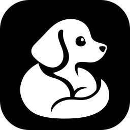
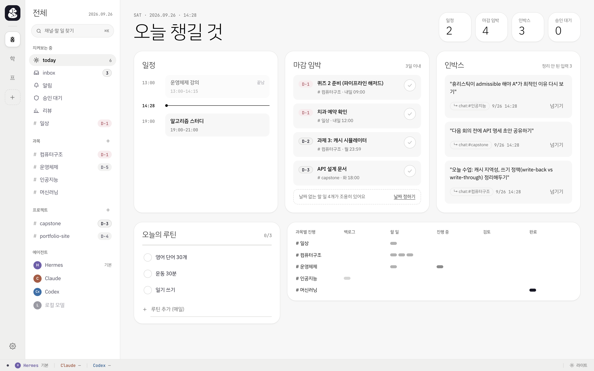
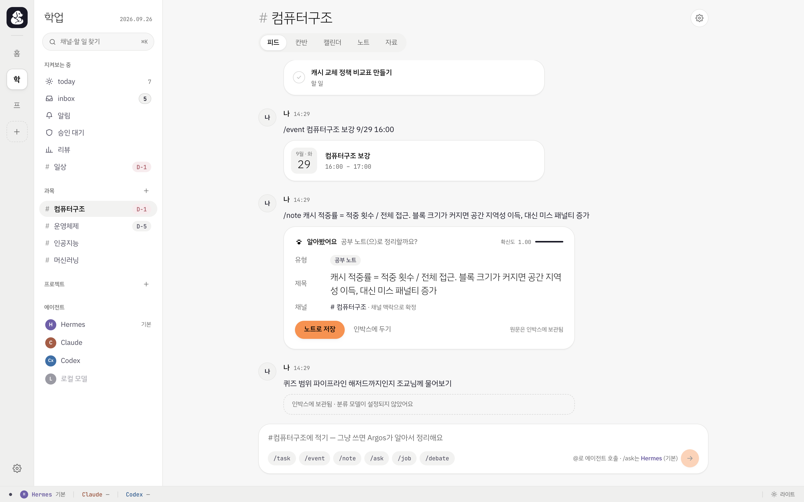
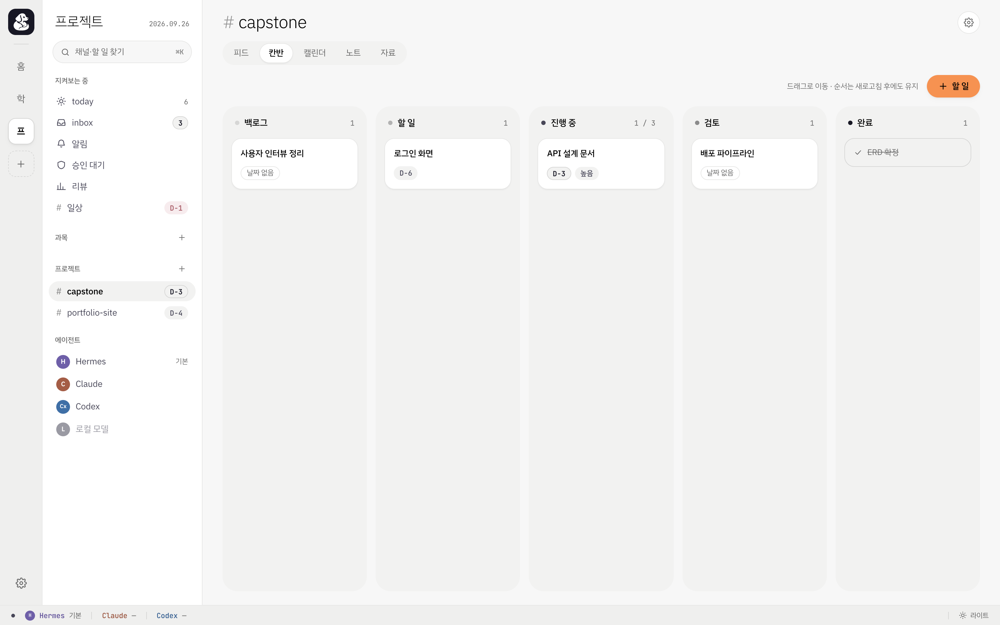
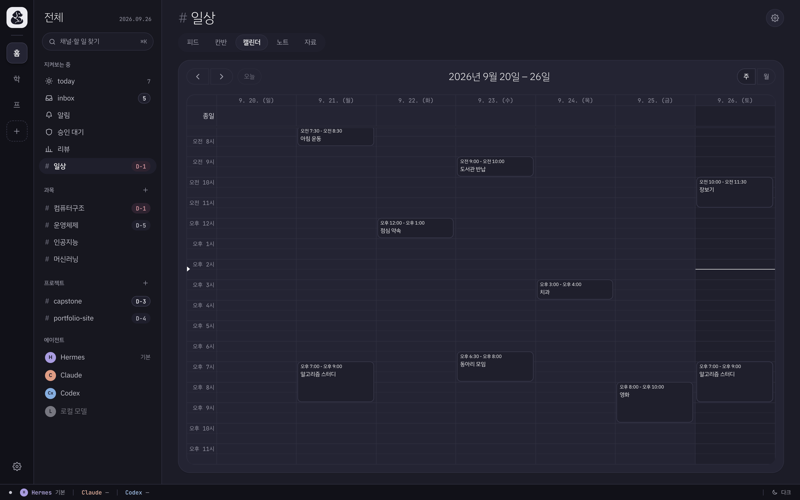
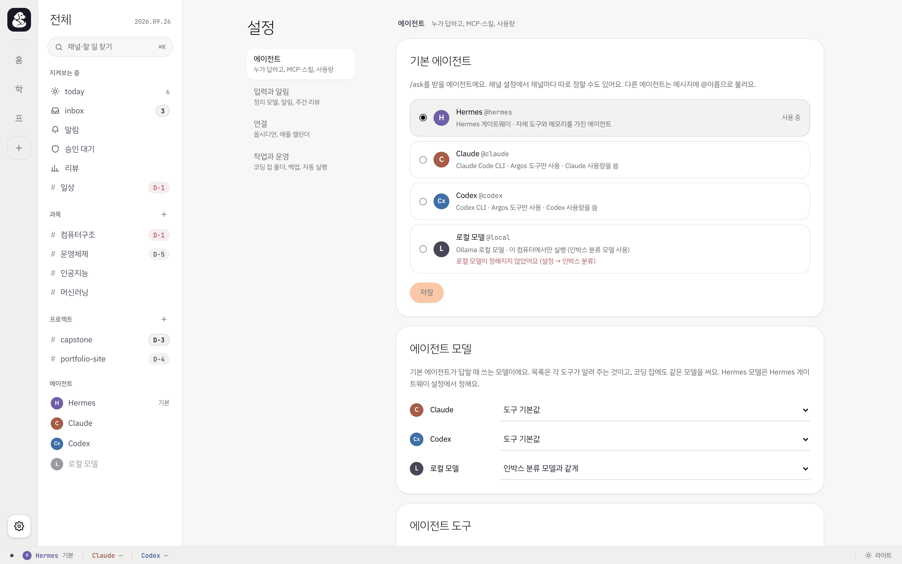
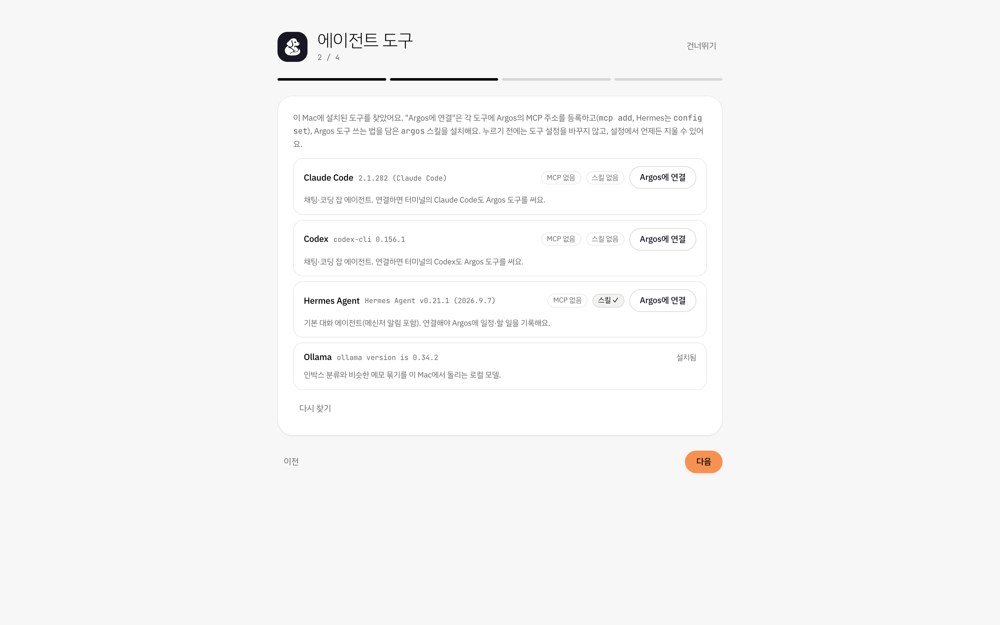
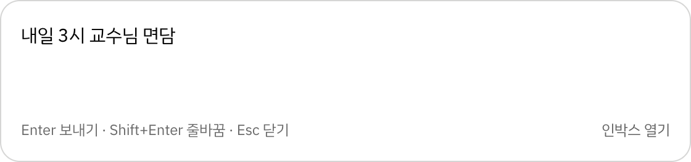

<div align="center">



# Argos

**A local-first desk for school and side projects — schedules, tasks, notes and AI agents in one place.**

**English** · [한국어](README.ko.md)

[](https://github.com/sciencemj/argos/actions/workflows/ci.yml)
[](https://github.com/sciencemj/argos/releases/latest)


<picture>
  <source media="(prefers-color-scheme: dark)" srcset="docs/images/today-dark.png" />
  
</picture>

</div>

Argos gives every course and project its own channel with a chat-style feed, a kanban board and a
calendar. Write things down the way you would text a friend — *"quiz on Friday"*, *"send the API draft
before the meeting"* — and Argos files them as tasks, events or notes. Your AI agents (Hermes, Claude
Code, Codex or a local model) work in the same place: they answer in threads, run coding jobs on your
cards and read or write your schedule through Argos' MCP server.

Everything runs on your Mac. The app binds to `127.0.0.1` only, keeps its data in
`~/Library/Application Support/Argos`, and stores secrets in the macOS Keychain.

> [!NOTE]
> The interface is in Korean for now ([한국어 README](README.ko.md)). The code is in English.

## Features

**Organize**
- **Channels per course and project**, grouped into areas, plus `#today`, `#inbox` and a personal `#일상`.
- **Feed first**: plain messages land in the inbox and are sorted by a local model (Ollama) or Hermes into
  tasks, events and notes; slash commands (`/task`, `/event`, `/note`, `/ask`, `/job`, `/debate`) skip the guessing.
- **Kanban** with WIP warnings and drag and drop, **calendar** (week and month) with recurring events,
  **Today** with deadlines, schedule, inbox and daily routines.
- **Obsidian vault**: full-text search, notes per channel, checkbox tasks synced both ways (Tasks and
  Dataview syntax), with backups before every edit.
- **Calendars**: an ICS feed for any calendar app and two-way iCloud (CalDAV) sync.
- **Notices and weekly review**: deadline and stale-inbox notices in the app, as macOS notifications
  or through Hermes to your messenger; a weekly review with numbers per course.

**Work with agents**
- **Hermes, Claude Code, Codex and local models** in threads and 1:1 chats; `@mention` any of them.
- **Coding jobs**: `/job` on a card runs Claude Code or Codex in an allowed folder and reports back on
  the card (todo → in progress → review).
- **Custom agents** with their own prompt, model and tool whitelist, importable as YAML, and
  **debates** between agents with a moderator.
- **MCP server** at `/mcp`: agents list channels, add tasks and events, capture notes, create new course
  or project channels; deletions wait for your approval.
- **Plan usage** for Claude and Codex in the status bar.

**Desktop app**
- Menu bar app: closing the window keeps sync, jobs and notices running.
- **Quick capture** anywhere with <kbd>⌘</kbd><kbd>⇧</kbd><kbd>Space</kbd>, straight into the inbox.
- **First-run setup** that finds your agent tools and connects them (MCP + an `argos` skill) in one click.
- **Automatic updates**, signed and checked against the public key built into the app.
- **Clean uninstall** that also removes what Argos added to your agent tools, login items and Keychain.

## Screenshots

| Channel feed | Kanban |
|---|---|
|  |  |
| **Calendar** | **Settings** |
|  |  |
| **First-run setup** | **Quick capture** (<kbd>⌘</kbd><kbd>⇧</kbd><kbd>Space</kbd>) |
|  |  |

## Install

1. Download `Argos_<version>_aarch64.dmg` from the [latest release](https://github.com/sciencemj/argos/releases/latest).
2. Open it and drag **Argos** into **Applications**.
3. The first time, **right-click Argos → Open**. The app is ad-hoc signed (no paid Apple developer
   certificate), so a double click shows an "unidentified developer" warning.
4. Follow the welcome screen: check your tools, connect them, pick defaults, turn on start at login.

Updates arrive on their own: Argos checks GitHub Releases every six hours, installs a new version in
the background and applies it on the next restart (or from the menu bar right away).

### Optional tools

Argos works on its own; each tool adds more.

| Tool | Adds | Get it |
|---|---|---|
| [Claude Code](https://docs.claude.com/en/docs/claude-code) | Chat and coding-job agent, plan usage | `npm install -g @anthropic-ai/claude-code` |
| [Codex](https://github.com/openai/codex) | Chat and coding-job agent, plan usage | `npm install -g @openai/codex` |
| Hermes Agent | Default chat agent, messenger notices | see [docs/hermes-setup.md](docs/hermes-setup.md) |
| [Ollama](https://ollama.com/download) | Local inbox sorting and note grouping | install, then pick a model in settings |
| [Obsidian](https://obsidian.md) | Notes and checkbox tasks per channel | pick your vault in settings |

### Connecting your agents

**Settings → Agents → Agent tools → "Argos에 연결"** registers Argos' MCP server with each tool's own CLI
and installs an `argos` skill that explains when to use it. The same card removes either one again.

| Tool | MCP | Skill |
|---|---|---|
| Claude Code | `claude mcp add --transport http --scope user argos …` | `~/.claude/skills/argos` |
| Codex | `codex mcp add argos --url …` | `~/.codex/skills/argos` |
| Hermes | `hermes config set mcp_servers.argos.url …` | added to `skills.external_dirs` |

After an update, Argos refreshes the skills and MCP addresses it installed — and never re-adds what you removed.

## Privacy and security

- The server listens on `127.0.0.1:8000` only; nothing is exposed to your network.
- Your data stays in `~/Library/Application Support/Argos` (SQLite, daily backups).
- The iCloud app-specific password lives in the Keychain; the Hermes key is read from Hermes' own
  `.env`; Claude and Codex use their own logins. Argos never stores or logs OAuth tokens.
- Text leaves your Mac only through the agents and models you choose (and Ollama `*-cloud` models,
  which the settings label as such).
- Agents cannot delete anything directly: deletions through MCP become approval requests.

## Development

Requirements: [uv](https://docs.astral.sh/uv/), [bun](https://bun.sh), and for the desktop app Rust
(rustup) and the Xcode command-line tools.

```bash
make install      # uv sync + bun install
make dev          # backend :8100 + frontend :5273 (Vite proxies /api and /ws)
make test         # pytest + vitest
make lint         # ruff, pyright (strict), biome, tsc
make api-types    # regenerate frontend/src/api-types.ts after changing API models
make app          # desktop app → desktop/build/Argos.app and Argos.dmg
make release VERSION=x.y.z   # bump, tag and push; CI builds, signs and publishes
```

Port 8000 belongs to the installed app (agents' MCP entries point there), so the development server
uses 8100/5273 and both can run at once. Development data lives in `backend/data`.

### Architecture

```
backend/    FastAPI + async SQLAlchemy (SQLite WAL), Alembic migrations
  argos/services.py    the single write path: activity log + WebSocket events
  argos/chat.py        routing a message: thread, @mention, slash command or inbox
  argos/runner.py      agent runs and coding jobs, streamed over WebSocket
  argos/agents.py      adapters: Hermes, Claude Agent SDK, Codex app-server, Ollama
  argos/mcp_server.py  the MCP server agents use
  argos/desktop.py     entry point of the server inside the desktop app
frontend/   React 19 + Vite + Tailwind v4 + TanStack Query
desktop/    Tauri 2 shell: sidecar server, menu bar, quick capture, updater
integrations/  the argos skills installed into agent tools
```

More in [docs/PLAN.md](docs/PLAN.md) (design and phases), [docs/desktop.md](docs/desktop.md) (the
app, updates and releases), [docs/mcp-setup.md](docs/mcp-setup.md) (MCP tools) and
[docs/decisions.md](docs/decisions.md) (decisions made along the way).
