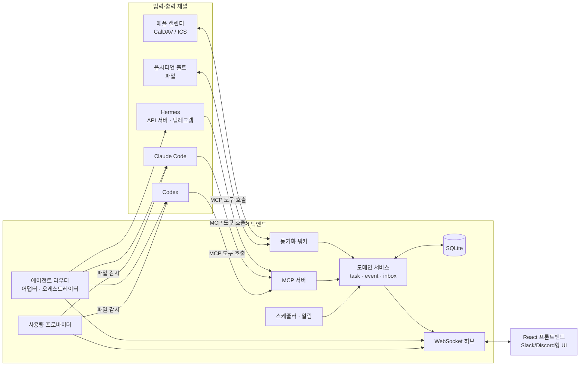

# Argos 개발 계획서 (PLAN.md)

> 이 문서는 코딩 에이전트(Claude Code, Codex 등)가 이 앱을 단계적으로 구현하기 위한 기준 문서다.
> 작업을 시작하기 전에 이 문서 전체를 읽고, **0장의 작업 규칙**을 항상 따른다.

---

## 0. 코딩 에이전트 작업 규칙

1. **한 번에 한 Phase만 진행한다.** 6장의 순서를 지키고, 각 Phase의 "완료 기준"을 모두 만족하면 멈추고 사용자에게 결과를 보고한 뒤 승인을 받는다.
2. **Phase 범위 밖의 기능을 미리 구현하지 않는다.** 필요해 보이면 `docs/decisions.md`에 메모만 남긴다.
3. **설계 결정은 기록한다.** 이 문서와 다른 선택을 했거나, 문서에 없는 결정을 내렸다면 `docs/decisions.md`에 날짜·결정·이유를 한 줄씩 남긴다.
4. **외부 시스템(캘린더, 옵시디언 볼트, 에이전트 CLI)을 건드리는 코드는 반드시 테스트용 가짜(fake) 구현과 함께 작성한다.** 개발 중 실제 개인 데이터를 수정하지 않는다.
5. **CLI·SDK 옵션은 추측하지 말고 현재 설치된 버전의 `--help`나 공식 문서로 확인한다.** Hermes, Claude Code, Codex는 업데이트가 잦다.
6. **8장 "확인 필요 사항"에 해당하는 값은 임의로 정하지 말고 설정 파일로 빼거나 사용자에게 묻는다.**
7. UI 문구와 문서는 한국어, 코드·식별자·커밋 메시지는 영어로 작성한다.

---

## 1. 배경과 목표

### 1.1 해결하려는 문제

- 일정과 할 일을 **여러 캘린더, 옵시디언 노트, Hermes 채팅** 등 여러 곳에서 추가하다 보니 각 도구가 부분적인 정보만 갖게 되고, 결국 일부를 잊어버린다.
- 수업 자료와 노트는 옵시디언에서 관리하지만, **옵시디언을 켜는 것 자체가 번거로워** 다른 곳에 따로 적는 일이 잦다.

### 1.1.1 이름: Argos

오디세이아에서 20년 만에 거지 차림으로 돌아온 오디세우스를 유일하게 알아본 충직한 개 **아르고스**에서 따왔다. "무엇이 어디서 들어오든 잊지 않고 알아본다"는 앱의 목표를 담는다. 앱 이름·패키지명·CLI 명령어는 `argos`로 통일한다. UI와 알림 문구에 개 콘셉트를 가볍게 녹여도 좋지만, 기능 이해를 방해하는 말장난은 피한다.

### 1.2 목표

1. **일정·할 일의 단일 진실원(SSOT)**: 어디서 입력하든 결국 이 앱의 DB에 모이고, 이 앱만 보면 모든 일정과 할 일이 보인다.
2. **옵시디언을 열지 않아도 되는 창구**: 노트와 수업 자료를 앱 안에서 검색·열람·빠른 추가할 수 있다.
3. **AI 에이전트 허브**: Hermes, Claude Code, Codex, 사용자 정의 에이전트를 Slack/Discord 같은 채팅 UI 안에서 부르고, 작업을 맡기고, 서로 토론시킬 수 있다.
4. **잊지 않게 하는 능동 알림**: 마감 임박, 방치된 인박스, 주간 리뷰를 앱이 먼저 알려준다.

### 1.3 하지 않을 것 (Non-goals)

- 옵시디언 수준의 마크다운 편집기를 만들지 않는다. (빠른 추가·간단한 수정만)
- 캘린더 앱 자체를 대체하지 않는다. (폰의 애플 캘린더는 계속 쓰되, 내용이 이 앱과 일치하게 한다)
- 다중 사용자·팀 기능은 만들지 않는다. 1인용 로컬 우선 앱이다.

---

## 2. 핵심 설계 원칙

모든 구현은 아래 원칙과 충돌하면 안 된다.

### P1. 영역별 진실원은 하나

| 데이터 | 진실원 | 앱의 역할 |
|---|---|---|
| 일정(event), 할 일(task), 인박스, 칸반 상태 | **앱 DB** | 저장·관리 |
| 노트 본문, 수업 자료 파일 | **옵시디언 볼트(파일)** | 색인·열람·최소 수정 |
| 외부 캘린더의 원본 일정 | 해당 캘린더 | 가져와서 DB에 미러링 |

노트 본문을 DB로 복제해 관리하지 않는다. DB에는 경로·제목·태그·색인 정보만 둔다.

### P2. 외부 도구는 "채널"이다

애플 캘린더, 옵시디언, Hermes, Claude Code, Codex는 입력하거나 보여주는 통로다. 이들이 독자적으로 일정을 보관하게 만드는 설계를 하지 않는다. 예: Hermes에게 일정을 말하면 Hermes 메모리가 아니라 MCP 도구로 앱 DB에 기록된다.

### P3. 모든 외부 항목은 출처를 추적한다

외부에서 온 객체는 `source_link` 레코드(`source`, `external_id`, `etag`/`hash`, `last_synced_at`)를 가진다. 동기화는 **멱등(idempotent)**해야 하며, 같은 항목을 두 번 가져와도 중복이 생기지 않아야 한다.

### P4. 메시지는 입력층, 객체가 진실

채팅 메시지로 "금요일까지 과제2"를 입력하면 `task` 객체가 생성되고, 메시지는 그 객체를 참조하는 카드로 렌더링된다. 객체가 바뀌면 카드 표시도 바뀐다. 채팅 로그의 텍스트를 상태의 근거로 삼지 않는다.

### P5. 파괴적 작업은 사람의 승인을 거친다

에이전트(내장·커스텀 포함)가 일정 삭제, 대량 수정, 옵시디언 파일 수정 등 되돌리기 어려운 작업을 하려 할 때는 `approval` 객체를 만들고 채팅에 승인 카드를 띄운다. 사용자가 ✅를 눌러야 실행된다.

### P6. 비공식 인터페이스는 격리한다

Claude Code·Codex 사용량 파일, CLI 출력 포맷처럼 공식 계약이 아닌 것은 전용 어댑터 모듈 안에만 두고, 실패 시 앱 전체가 아니라 해당 표시만 "—"로 떨어지게 한다.

---

## 3. 기술 스택과 저장소 구조

### 3.1 스택

| 영역 | 선택 | 비고 |
|---|---|---|
| 패키지 관리 | `uv` (Python 3.13) / `bun` (패키지 설치·스크립트 실행만) | 백엔드 단일 Python 패키지 |
| 백엔드 | `fastapi`, `uvicorn[standard]` (+ WebSocket) | async 기반 |
| DB | SQLite + `sqlalchemy[asyncio]` 2.x + `aiosqlite` + `alembic` | WAL 모드. SQLModel 사용 안 함. 검색은 내장 FTS5 |
| 설정 | `pydantic-settings` | `.env` |
| 백그라운드 작업 | asyncio 태스크 (FastAPI `lifespan`) | 동기화 폴링, 알림. APScheduler 사용 안 함 |
| 파일 감시 | `watchfiles` | 옵시디언 볼트, 사용량 파일. `uvicorn[standard]`에 포함 |
| 캘린더 | `caldav`, `icalendar`, `recurring-ical-events` | iCloud CalDAV, ICS 피드, RRULE 전개 |
| 옵시디언 | `python-frontmatter` | 프론트매터 파싱. 체크박스는 정규식 |
| MCP | 공식 `mcp` SDK (FastMCP) | Streamable HTTP를 FastAPI 앱에 마운트 (같은 프로세스, 같은 domain 서비스) |
| LLM (분류·일반) | `openai` SDK + 설정의 `base_url` | provider는 `ollama` / `hermes` 두 개만 구현. 클라우드 API 직접 호출은 아직 만들지 않음 |
| 코딩 에이전트 | `claude-agent-sdk` / `codex exec --json` subprocess | Phase 5 |
| 프론트엔드 | React + TypeScript + Vite, `@tanstack/react-query`, `react-router` | 전역 상태 라이브러리 없음 |
| UI | Tailwind v4 (디자인 토큰 = CSS 변수), `cmdk`(⌘K) | 디자인: `docs/design/` (라이트·다크). shadcn/ui 사용 안 함 |
| 드래그앤드롭 | `@dnd-kit/core`, `@dnd-kit/sortable` | 칸반 |
| 캘린더 뷰 | `@fullcalendar/react` v6 (daygrid, timegrid, interaction) | 주간·월간. v7은 플러그인 미호환이라 v6 고정 |
| 기타 프론트 | `react-markdown` + `remark-gfm`, `date-fns` + `@date-fns/tz` | 노트 렌더링, Asia/Seoul 표시 |
| API 타입 | `openapi-typescript` + `openapi-fetch` | FastAPI OpenAPI에서 생성. WS 타입은 수동 |
| 테스트 | `pytest`, `pytest-asyncio`, `httpx2` / `vitest`, Testing Library | |
| 린트·포맷 | `ruff`, `pyright` / Biome | |
| 개발 실행 | 루트 `Makefile`의 `make dev` | Vite proxy로 `/api`, `/ws` 연결. 운영 시 FastAPI가 빌드된 프론트를 서빙 |

### 3.2 저장소 구조 (제안)

```
argos/
├── docs/
│   ├── PLAN.md              # 이 문서
│   └── decisions.md         # 설계 결정 로그
├── backend/
│   ├── pyproject.toml
│   ├── alembic/
│   └── src/argos/
│       ├── main.py          # FastAPI 앱 진입점
│       ├── config.py        # 설정 (pydantic-settings, .env)
│       ├── db/              # 모델, 세션, 마이그레이션 헬퍼
│       ├── domain/          # task, event, inbox, channel 등 비즈니스 로직
│       ├── api/             # REST 라우터
│       ├── ws/              # WebSocket 허브, 이벤트 스키마
│       ├── agents/          # 어댑터, 라우터, 오케스트레이터, 커스텀 에이전트
│       ├── sync/            # caldav, ics, obsidian 동기화
│       ├── usage/           # Claude Code / Codex 사용량 프로바이더
│       ├── mcp_server/      # MCP 도구 정의
│       └── jobs/            # 스케줄 작업, 알림
│   └── tests/
│       └── fixtures/        # 샘플 볼트, 샘플 ICS, 샘플 codex/claude 로그
└── frontend/
    ├── package.json
    └── src/
        ├── app/             # 레이아웃 셸
        ├── features/        # chat, kanban, calendar, inbox, courses, statusbar
        ├── ws/              # WebSocket 클라이언트
        └── components/
```

### 3.3 실행 환경

- macOS에서 상시 실행하는 **로컬 우선** 앱. 옵시디언 볼트가 로컬 파일이기 때문이다.
- 서버는 기본적으로 `127.0.0.1`에만 바인딩한다. 외부(폰 등) 접속은 Tailscale 같은 사설망을 통해서만 연다.
- 상시 실행은 추후 `launchd` 서비스로 등록한다(Phase 11).

---

## 4. 아키텍처



**데이터 흐름 원칙**: 어떤 경로(UI, MCP, 동기화)로 들어오든 쓰기는 반드시 `domain/` 서비스 계층을 거친다. API 라우터나 MCP 도구가 DB에 직접 쓰지 않는다. 도메인 서비스는 쓰기 후 `activity_log`를 남기고 WebSocket 이벤트를 발행한다.

---

## 5. 데이터 모델

필드는 핵심만 적었다. 모든 테이블에 `id`(UUID 또는 ULID), `created_at`, `updated_at`을 둔다. **시간은 모두 UTC로 저장**하고, 표시할 때 `Asia/Seoul`로 변환한다.

| 테이블 | 주요 필드 | 설명 |
|---|---|---|
| `area` | name, icon, sort_order | 왼쪽 레일의 영역 (학업, 프로젝트, 동아리 등) |
| `channel` | area_id, name, kind(`course`/`project`/`system`), default_agent_id, vault_path | 과목·프로젝트 채널. `#today`, `#inbox`는 system |
| `message` | channel_id, thread_root_id, author_type(`user`/`agent`/`system`), author_id, body, ref_type, ref_id, run_id | 채팅 메시지. `ref_*`로 객체를 참조 |
| `task` | channel_id, title, description, status, position(float), due_at, priority | 할 일이자 칸반 카드 |
| `event` | channel_id, title, starts_at, ends_at, start_date, end_date, location, rrule, calendar_id | 일정. 시간 일정은 starts_at/ends_at, 종일 일정은 start_date/end_date(끝 날짜 미포함). all_day는 파생값 |
| `inbox_item` | raw_text, captured_via, status(`new`/`suggested`/`accepted`/`dismissed`), suggestion_json, confidence | 원본 입력과 AI 분류 제안 |
| `note_ref` | vault_path, title, channel_id, tags, content_hash, indexed_at | 옵시디언 노트 색인 (본문 저장 안 함, 검색용 텍스트 인덱스는 FTS5 별도 테이블) |
| `source_link` | object_type, object_id, source, external_id, etag, content_hash, last_synced_at | 외부 출처 추적 (P3) |
| `activity_log` | object_type, object_id, action, before_json, after_json, actor | 모든 변경 이력. 칸반 상태 변화 분석에 사용 |
| `agent` | name, display_name, avatar, backend, model, system_prompt, tools_json, is_builtin | 내장·커스텀 에이전트 정의 |
| `agent_run` | agent_id, channel_id, thread_root_id, kind(`chat`/`job`/`debate`), status, started_at, finished_at, task_id | 에이전트 실행 단위 |
| `debate` | channel_id, topic, mode, participants_json, max_rounds, status, summary_task_id | 토론 세션 |
| `approval` | requested_by_run_id, action, payload_json, status | 파괴적 작업 승인 요청 (P5) |
| `usage_snapshot` | provider, window, used_percent, resets_at, observed_at | 사용량 기록 |

**task.status 값**: `backlog`, `todo`, `in_progress`, `review`, `done`.
**position**: 칸반 정렬용 실수값. 두 카드 사이에 넣을 때 평균값을 쓴다. 간격이 너무 좁아지면 해당 컬럼만 재번호.

---

## 6. 구현 순서

각 Phase는 앞 Phase가 완료되어야 시작한다. 완료 기준을 모두 만족하면 멈추고 보고한다.

### Phase 0. 프로젝트 기반

**목표**: 빈 앱이 뜨고, 테스트와 마이그레이션이 돌아가는 상태.

- `uv`로 백엔드 패키지 생성, ruff·mypy·pytest 설정
- Vite + React + TS 프론트엔드 생성, ESLint·Prettier 설정
- `config.py`: `.env`에서 설정 로드 (DB 경로, 볼트 경로, 각종 키). `.env.example` 제공, `.env`는 git에서 제외
- SQLite 연결(WAL 모드), Alembic 초기 마이그레이션
- `GET /health` 엔드포인트, 프론트에서 호출해 표시
- 개발용 실행 스크립트 (백엔드·프론트 동시 실행)

**완료 기준**: 명령 하나로 백·프론트가 실행된다 / 빈 DB 마이그레이션 성공 / 테스트·린트 통과.

### Phase 1. 코어 도메인과 REST API

**목표**: 앱 자체만으로 일정·할 일을 관리할 수 있다. (외부 연동 없음)

- 5장의 `area`, `channel`, `task`, `event`, `inbox_item`, `message`, `activity_log` 모델
- `domain/` 서비스: 생성·수정·삭제·상태 변경, 모든 쓰기에서 `activity_log` 기록
- REST API: 채널 목록, 채널별 task/event 조회, task CRUD 및 상태·위치 변경, event CRUD, inbox CRUD
- 초기 시드 데이터: 영역 몇 개, `#today`, `#inbox` 시스템 채널 (과목 채널 목록은 설정 파일에서 읽음)
- "오늘" 조회 API: 오늘 일정 + 마감 임박 task + 미처리 inbox 개수

**완료 기준**: API로 과목 채널에 task·event를 만들고 조회할 수 있다 / 상태 변경이 activity_log에 남는다 / 도메인 서비스 단위 테스트.

### Phase 2. UI 셸과 실시간 갱신

**목표**: Slack/Discord형 레이아웃에서 기본 기능을 쓸 수 있다.

- 레이아웃: 왼쪽 레일(영역) / 사이드바(채널, DM 섹션 자리) / 메인(채널 피드 + 상단 탭) / 오른쪽 패널(스레드·카드 상세) / 하단 상태 표시줄 자리
- 채널 상단 탭: `피드 | 칸반 | 캘린더` (노트·자료 탭은 Phase 8)
- **Today 화면**: 오늘 일정, 임박 마감, 인박스 배지
- **칸반**: dnd-kit 드래그앤드롭, 과목별 스윔레인(Home 화면), In Progress WIP 제한(기본 3, 설정 가능, 초과 시 경고만)
- **캘린더 뷰**: 주간·월간 기본 뷰
- **WebSocket 허브**: 7.2절의 이벤트 스키마 중 `object.*` 이벤트 구현. 한 탭에서 바꾼 내용이 다른 탭에 즉시 반영
- ⌘K 퀵 스위처(채널·task 검색)

**완료 기준**: 브라우저에서 task 생성→칸반 이동→다른 창에 실시간 반영 / 새로고침 후에도 순서 유지.

### Phase 3. 채팅 입력과 인박스 AI 분류

**목표**: "메시지를 보내는 것"이 곧 입력이 된다.

- 채널 피드의 메시지 입력창. 메시지 저장 후 피드에 표시
- **슬래시 커맨드**: `/task`, `/event`, `/note`, `/ask` (파서는 결정적으로, LLM 없이)
- **자연어 입력 분류**: 슬래시 없이 입력된 메시지는 원본을 `inbox_item`으로 먼저 저장한 뒤 LLM으로 분류
  - 구조화 출력(JSON 스키마): `type`(task/event/idea/study_note), `title`, `due_at`/`starts_at`, `channel_hint`, `tags`, `summary`, `confidence`
  - **채널 맥락을 입력에 포함**: 과목 채널에서 입력하면 과목이 이미 정해진 것으로 취급
  - 확신도가 임계값 이상이고 사용자가 해당 유형의 자동 반영을 켰으면 바로 객체 생성, 아니면 "이렇게 정리할까요?" 제안 카드
- **리액션 = 빠른 액션**: ✅ 완료, 📅 일정으로, 🗂 칸반으로, 📌 고정
- 스레드: 모든 메시지·카드에 스레드 열기
- 분류용 LLM 호출은 `agents/` 어댑터를 쓰지 말고 우선 단순 클라이언트로 구현하되, Phase 5에서 기본 에이전트 설정으로 교체 가능하게 인터페이스를 둔다
  - 설정: `classifier.provider`(`ollama` | `hermes`), `model`, `base_url`, `api_key`(hermes만). 두 provider 모두 `openai` SDK의 OpenAI 호환 API로 호출
  - 구조화 출력: JSON 스키마 `response_format`을 우선 사용하고, 지원하지 않으면 프롬프트로 JSON 요청 후 Pydantic으로 검증. 검증 실패 시 원본은 인박스에 남긴다
  - 클라우드 API(Claude 등) 직접 호출 provider는 **아직 만들지 않는다**. 설정값만 확장 가능하게 둔다

**완료 기준**: `#컴퓨터구조`에서 "금요일까지 과제2"를 입력하면 제안 카드가 뜨고, 승인 시 해당 채널 task가 생성되어 칸반에 보인다 / 분류 실패해도 원본은 인박스에 남는다.

### Phase 4. MCP 서버

**목표**: 외부 에이전트가 앱의 공통 인터페이스로 데이터를 읽고 쓴다.

- 도구 목록 (최소):
  - 읽기: `get_today`, `get_schedule(range)`, `list_tasks(filter)`, `list_inbox`, `search_notes`(Phase 8 이후 활성), `get_course_progress`
  - 쓰기: `add_task`, `update_task`, `move_task`, `create_event`, `update_event`, `capture_note`
  - 파괴적: `delete_task`, `delete_event` → **즉시 실행하지 않고 approval 생성** (P5)
- 모든 도구는 `domain/` 서비스를 호출 (DB 직접 접근 금지)
- 호출자 식별: MCP 연결별로 에이전트 ID를 붙여 activity_log의 actor에 기록
- stdio와 HTTP 전송 중 Hermes·Claude Code·Codex가 각각 지원하는 방식을 확인해 제공

**완료 기준**: Claude Code에서 MCP로 `add_task`를 호출하면 UI에 실시간으로 카드가 나타난다 / 삭제 요청은 승인 카드로 뜬다.

### Phase 5. 에이전트 어댑터와 채팅 라우팅

**목표**: 앱 안에서 기본 에이전트와 대화하고, 멘션으로 다른 에이전트를 부른다.

- **어댑터 인터페이스** (`agents/base.py`):

  ```python
  class AgentAdapter(Protocol):
      id: str
      async def stream(self, transcript: list[Message], context: Context) -> AsyncIterator[AgentEvent]: ...
      async def cancel(self, run_id: str) -> None: ...
  ```

  `AgentEvent`는 `token`, `status`(thinking/tool_use 등), `done`, `error` 중 하나.
- **구현할 어댑터**:
  - `HermesAdapter`: Hermes gateway의 OpenAI 호환 API (기본 `127.0.0.1:8642`, API 키 필요). 스트리밍 사용
  - `LLMAdapter`: 일반 LLM API 또는 Ollama (가벼운 분류·토론용)
  - `ClaudeCodeAdapter`, `CodexAdapter`: headless 모드 CLI를 subprocess로 실행하고 JSON 스트림 출력을 파싱. 옵션은 설치된 버전에서 확인
- **라우팅 규칙**:
  1. 메시지에 멘션이 없으면 → 스레드에 고정된 에이전트 → 채널 기본 에이전트 → 전역 기본 에이전트 순
  2. 멘션이 하나면 그 에이전트가 답하고, **해당 스레드에 고정(sticky)**된다. 다른 멘션이 오면 교체
  3. 멘션이 둘 이상이면 각 에이전트가 독립적으로 병렬 응답
- **컨텍스트 주입**: 채널 정보(과목명, 최근 task, 관련 노트 요약)를 시스템 메시지로 전달. 크기 상한을 둔다
- DM 섹션에 에이전트를 봇 사용자로 표시, 실행 중에는 "입력 중…" 상태
- 실행 취소 버튼 → `run.cancel`
- Hermes에게 "일정 기록은 자체 메모리가 아니라 앱 MCP 도구를 쓰라"는 지침을 설정하는 방법을 문서화 (`docs/hermes-setup.md`)

**완료 기준**: 기본 에이전트와 스트리밍 대화 / `@claude` 멘션 후 같은 스레드에서 계속 Claude가 응답 / 두 에이전트 동시 멘션 시 두 버블이 섞이지 않고 동시에 스트리밍 / 취소 동작.

### Phase 6. 코딩 에이전트 잡과 칸반 연동

**목표**: Claude Code·Codex에 무거운 작업을 맡기고 칸반에서 추적한다.

- 채팅에서 잡 생성 (예: 스레드에서 "@codex 이 과제 코드 초안 만들어줘" + 잡 모드 선택) → `agent_run(kind=job)` + 연결된 task 카드 생성
- 카드 자동 이동: 실행 시작 → `in_progress`, 완료 → `review`, 실패 → 카드에 오류 표시. `done`은 사용자가 직접 옮긴다
- 작업 디렉터리(워크스페이스)는 잡마다 명시적으로 지정. 기본값은 설정의 안전한 경로로 제한
- 실행 로그와 결과 요약을 카드 스레드에 기록
- 동시 실행 개수 제한 (설정값, 기본 1~2)

**완료 기준**: 잡 하나를 끝까지 실행해 카드가 `review`에 도착하고 스레드에 결과가 남는다.

### Phase 7. 애플 캘린더 연동

**목표**: 앱과 애플 캘린더의 일정이 일치한다.

- **7a. ICS 피드 (단방향, 먼저)**: `GET /calendar/feed.ics?token=...` 로 앱의 일정·마감을 내보내고, 애플 캘린더에서 구독. 토큰으로 보호
- **7b. CalDAV 양방향**:
  - iCloud 앱 전용 암호로 `caldav.icloud.com` 접속 (자격 증명은 macOS Keychain 또는 `.env`, 코드·로그에 절대 출력 금지)
  - **읽기**: 설정에서 선택한 캘린더들의 일정을 가져와 `event` + `source_link`로 저장
  - **쓰기**: 앱에서 만든 일정은 **전용 "Dashboard" 캘린더에만** 생성·수정·삭제. 다른 캘린더에는 쓰지 않는다
  - 주기적 폴링(기본 10분) + 수동 동기화 버튼. etag로 변경 감지
  - **충돌 정책**: 양쪽이 모두 바뀌었으면 자동 병합하지 말고 충돌 카드를 띄워 사용자가 선택
  - 반복 일정(RRULE)은 우선 **읽기 전용**으로 표시만 하고 앱에서 수정 불가 처리
- 7a 완료 후 7b 전에 보고한다

**완료 기준**: 폰 캘린더에서 추가한 일정이 10분 내 앱에 보이고, 앱에서 추가한 일정이 폰의 Dashboard 캘린더에 보인다 / 두 번 동기화해도 중복 없음.

### Phase 8. 옵시디언 연동과 과목 페이지

**목표**: 옵시디언을 열지 않고도 노트와 할 일을 다룬다.

- **색인**: 볼트를 스캔해 `note_ref` 생성, 본문은 SQLite FTS5로 검색 인덱스만 구성. `watchdog`로 변경 감지 후 증분 갱신
- **채널 매핑**: 과목 채널의 `vault_path`(예: `강의/컴퓨터구조/`) 하위 노트를 해당 채널에 연결
- **할 일 파싱**: 노트의 체크박스 할 일(Tasks 플러그인 형식 `- [ ] 내용 📅 YYYY-MM-DD` 등)을 task로 가져온다. 가져온 줄에는 블록 ID(`^argos-xxxx`)를 **그 줄 끝에만** 추가해 이후 매칭에 사용
- **양방향 체크 동기화**: 앱에서 완료 → 해당 줄의 `[ ]`만 `[x]`로 바꾼다. 노트에서 체크 → 앱 task 완료
- **과목 페이지 탭**: `노트 | 자료` 탭 추가. 노트 목록·검색·마크다운 읽기 전용 렌더링, 자료(PDF 등) 목록
- **빠른 노트 추가**: `/note`나 인박스의 study_note를 승인하면 설정된 폴더에 새 마크다운 파일 생성 (기존 파일 수정 아님)
- `search_notes` MCP 도구 활성화

**완료 기준**: 과목 채널에서 노트를 검색·열람 / 노트의 할 일이 칸반에 보이고 체크 상태가 양방향으로 반영 / 볼트 파일이 의도한 한 줄 외에는 바뀌지 않음(diff 테스트).

### Phase 9. 사용량 상태 표시줄

**목표**: 화면 하단에서 Claude Code·Codex의 남은 사용량을 본다.

- `UsageProvider` 인터페이스, 프로바이더별 모듈로 격리 (P6)
- **Claude Code**: statusLine 스크립트가 stdin JSON의 `rate_limits.five_hour` / `seven_day`(`used_percentage`, `resets_at`)를 받아 상태 파일(예: `~/.claude/argos-usage.json`)에 **원자적으로** 기록. 앱은 이 파일을 감시. 필드가 없는 경우(플랜·버전 문제, 세션 첫 응답 전)를 정상 상황으로 처리. 설치용 스크립트와 설정 안내 제공
- **Codex**: `~/.codex/sessions/**/rollout-*.jsonl`에서 가장 최근 `token_count` 이벤트의 `rate_limits`를 읽음. **primary/secondary 이름이 아니라 `window_minutes`로 5시간·주간 창을 구분**
- 표시: `● 현재 에이전트(모델) │ Claude 5h 42% ⏱2h13m · 7d 15% │ Codex 5h 30% · 7d 19% │ 동기화 ✓ 1분 전`
  - 70% 이상 노랑, 90% 이상 빨강
  - 관측 시각 표시, 리셋 시각이 지난 값은 "—"
  - 클릭 시 팝오버: 리셋까지 남은 시간, 현재 실행 중 잡의 컨텍스트 사용량, 오늘 잡 수
- WebSocket `usage.updated` 이벤트로 푸시
- **라우팅 연동**: 호출하려는 에이전트의 5시간 창이 90% 이상이면 다른 에이전트로 보낼지 제안

**완료 기준**: 샘플 로그 fixture로 파싱 테스트 통과 / 실제 파일이 바뀌면 수 초 내 상태줄 갱신 / 파일이 없거나 포맷이 깨져도 앱은 정상 동작.

### Phase 10. 커스텀 에이전트와 멀티 에이전트 토론

**목표**: 사용자가 에이전트를 만들고, 여러 에이전트가 토론한다.

- **커스텀 에이전트**: UI 폼("봇 만들기") + YAML 가져오기/내보내기

  ```yaml
  name: tutor
  display_name: 과목 튜터
  avatar: 🎓
  backend: llm            # 어떤 어댑터 위에서 동작하는지
  model: <설정값>
  system_prompt: |
    채널 과목의 볼트 노트를 근거로 설명하는 튜터...
  tools: [search_notes, get_course_progress]   # 허용 MCP 도구 (화이트리스트)
  default_channels: ["#컴퓨터구조"]
  ```

  - 도구는 화이트리스트 방식. 쓰기 도구는 명시적으로 허용해야 하며, 파괴적 도구는 허용해도 항상 approval을 거친다
- **토론 오케스트레이터**: `/debate @a @b [@c] 주제 [--mode round_robin|pro_con|moderated] [--rounds N]`
  - 각 에이전트에게 화자가 표시된 공유 기록(`[codex]: ...`)을 전달
  - moderated 모드는 기본 에이전트가 사회자로 다음 발언자와 종료 시점을 결정
  - 안전장치: 최대 라운드, 토큰·시간 예산, 사용자 개입·중단
  - 종료 시 사회자가 요약 + 결론을 작성하고, 원하면 task나 노트로 보낸다
  - Claude Code·Codex는 토론에서 **도구 없는 대화 모드**로 호출하는 옵션 (비용·속도)
  - 시작 전 참가자 사용량 확인 (Phase 9 연동)
- 토론은 하나의 스레드로 표시, 각 턴은 `debate.turn` 이벤트

**완료 기준**: 커스텀 에이전트를 만들어 멘션으로 호출 / 허용되지 않은 도구 호출이 차단됨 / 3자 토론이 라운드 제한 내에서 끝나고 요약 카드 생성.

### Phase 11. 능동 알림, 리뷰, 운영

**목표**: 앱이 먼저 챙겨준다.

- 마감 D-3·D-1 알림, 24시간 이상 방치된 인박스 경고, 날짜 없는 task 알림
- 알림 채널: 앱 내 배지 + Hermes를 통한 메신저 전송(선택)
- 주간 리뷰: 이번 주 done 카드 요약, 오래된 backlog 정리 제안, 인박스 아이디어 묶기(임베딩 유사도)
- 분석: activity_log 기반 과목별 처리 시간, 주간 완료 수
- 외부 소비용 요약 API (예: 개인 아침 브리핑이 이 앱을 일정 데이터 출처로 쓰도록 `GET /briefing/today`)
- `launchd` 등록, DB 자동 백업(일 1회, 보관 개수 설정)

**완료 기준**: 테스트용 마감으로 알림이 발생 / 주간 리뷰 메시지 생성 / 재부팅 후 자동 실행.

---

## 7. 인터페이스 명세

### 7.1 REST 규칙

- 경로 prefix `/api/v1`
- 목록 API는 커서 페이지네이션
- 오류 응답 형식 통일: `{ "error": { "code": "...", "message": "..." } }`

### 7.2 WebSocket 이벤트

모든 이벤트는 `{ "type": ..., "data": ..., "ts": ... }` 형식. 에이전트 관련 이벤트에는 반드시 `run_id`, `agent_id`를 포함한다.

| type | 방향 | 설명 |
|---|---|---|
| `object.created` / `object.updated` / `object.deleted` | S→C | task·event·inbox 등 변경 |
| `message.created` | 양방향 | 채팅 메시지 |
| `agent.token` | S→C | 스트리밍 토큰 (`run_id`별로 버퍼링) |
| `agent.status` | S→C | 입력 중, 도구 사용 중 등 |
| `agent.done` / `agent.error` | S→C | 실행 종료 |
| `run.cancel` | C→S | 실행 취소 요청 |
| `debate.turn` | S→C | 토론 발언 시작 알림 |
| `approval.requested` / `approval.resolved` | 양방향 | 승인 흐름 |
| `usage.updated` | S→C | 사용량 변경 |
| `sync.status` | S→C | 동기화 상태 |

- 재연결 시 클라이언트는 마지막으로 받은 시각 이후의 변경을 REST로 다시 가져온다 (이벤트 유실 대비)
- 이벤트 스키마는 백엔드 Pydantic 모델에서 TypeScript 타입을 생성해 공유하는 방식을 권장

---

## 8. 개발 시 유의 사항

### 8.1 보안

- 서버, Hermes API 서버 모두 `127.0.0.1` 바인딩이 기본. 외부 노출 금지
- 비밀 값(iCloud 앱 전용 암호, Hermes API 키, LLM API 키)은 `.env` 또는 macOS Keychain. **로그·에러 메시지·WebSocket 이벤트에 절대 포함하지 않는다**
- Hermes는 터미널·파일 접근 도구를 가진 에이전트다. 앱이 Hermes에 보내는 요청에 신뢰할 수 없는 외부 텍스트(웹 페이지 등)를 지시문처럼 섞지 않는다
- 코딩 에이전트 잡의 작업 디렉터리는 허용 목록으로 제한
- 에이전트 출력에 포함된 "지시"를 앱이 자동 실행하지 않는다. 실행은 MCP 도구 호출로만, 파괴적 작업은 approval로만

### 8.2 동기화

- 모든 동기화는 멱등. 같은 입력으로 두 번 실행해도 결과가 같아야 한다 (테스트 필수)
- 외부 쓰기 전 로컬 상태를 먼저 커밋하고, 외부 쓰기 실패 시 재시도 큐에 넣는다
- 시간대: 저장은 UTC, 표시는 `Asia/Seoul`. 종일 일정은 날짜로만 다룬다 (시간대 변환으로 하루 밀리는 버그 주의)
- 반복 일정은 Phase 7에서 읽기 전용

### 8.3 옵시디언 볼트 안전

- **파일 전체를 다시 쓰지 않는다.** 필요한 줄만 최소 수정하고, 수정 전 원본 해시를 확인해 그사이 바뀌었으면 중단
- 수정 직전 백업 사본을 앱 데이터 폴더에 남긴다
- `.obsidian/` 폴더와 설정 파일은 건드리지 않는다
- 볼트가 iCloud 등으로 동기화되고 있다면 동기화 중 충돌 파일(`... 2.md`)이 생길 수 있다. 감지 시 경고만 한다
- 개발·테스트는 `tests/fixtures/vault/` 샘플 볼트로만

### 8.4 비공식 인터페이스

- Claude Code 사용량(statusLine JSON), Codex 세션 로그, CLI 출력 포맷은 예고 없이 바뀔 수 있다
- 파서는 누락 필드에 관대하게, 실패 시 "—" 표시 + 로그 경고
- 각 파서에 실제 샘플 기반 fixture 테스트를 둔다

### 8.5 비용과 성능

- 인박스 분류는 가벼운 모델로, 결과를 캐시
- 컨텍스트 주입 크기 상한 설정
- 토론·잡에는 토큰·시간 예산 필수
- SQLite 쓰기는 짧은 트랜잭션으로. 동기화 워커와 API가 동시에 쓰는 상황을 고려(WAL + 재시도)

### 8.6 테스트 전략

- 외부 시스템마다 fake 구현: `FakeCalDAV`, 샘플 볼트, `FakeAgentAdapter`(정해진 토큰을 스트리밍), 샘플 사용량 로그
- 도메인 서비스는 단위 테스트, API·WebSocket은 통합 테스트
- 옵시디언 수정은 "의도한 줄 외 변경 없음"을 diff로 검증

---

## 9. 확인 필요 사항 (사용자에게 묻거나 설정으로 뺄 것)

| 항목 | 필요한 시점 |
|---|---|
| 초기 영역·과목 채널 목록 | Phase 1 |
| 인박스 분류 모델 이름 (provider는 `ollama`/`hermes` 중 설정으로 선택. 결정됨) | Phase 3 |
| 기본 에이전트에 쓸 모델·공급자 | Phase 5 |
| 인박스 자동 반영 확신도 임계값 | Phase 3 |
| Hermes 설치 위치, API 서버 포트·키 | Phase 5 |
| 코딩 에이전트 잡 허용 작업 디렉터리 | Phase 6 |
| 동기화할 애플 캘린더 목록, Dashboard 캘린더 이름 | Phase 7 |
| 옵시디언 볼트 경로, 과목별 폴더 구조, 할 일 표기 형식(Tasks 플러그인 사용 여부) | Phase 8 |
| 알림을 받을 메신저 채널 | Phase 11 |

---

## 10. 용어

- **SSOT**: 단일 진실원. 일정·할 일은 앱 DB
- **채널**: 과목·프로젝트 단위의 대화·작업 공간
- **인박스**: 분류 전 원본 입력 보관함
- **잡(job)**: 코딩 에이전트에 맡긴 비대화형 작업. 칸반 카드와 연결됨
- **approval**: 파괴적 작업 실행 전 사용자 승인 요청
